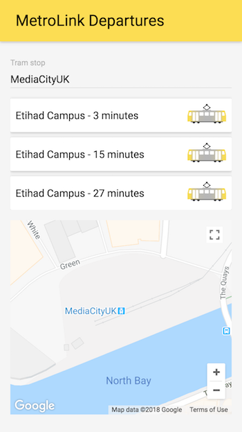

# GraphQL Dojo

In this Dojo, we will be building a Metrolink live departures app using GraphQL and React.

It will use data from the TFGM API: https://developer.tfgm.com/ and the National Public Transport Access Nodes (NaPTAN) data set: https://data.gov.uk/dataset/ff93ffc1-6656-47d8-9155-85ea0b8f2251/national-public-transport-access-nodes-naptan



## Slides

https://docs.google.com/presentation/d/1RSxIgnk0N6gvvrFxJ4oiky34EI4CKT8fbmY5PAC8oRI/edit?usp=sharing

## Setup Instructions

```bash
git clone git@github.com:mmmurray/graphql-dojo.git

cd graphql-dojo

npm install

npm start
```

If all is well, you should be able to view the React app at http://localhost:3000/ and the GraphiQL tool at http://localhost:3001/graphiql

## Exercise 1 - Designing a schema

Designing the schema for a GraphQL API can be a tricky job. You need to consider all the different use cases of the API to best represent these as types and fields.

#### What you need to do 👈

```bash
git checkout ex1
```

Open up `src/server/types.graphql`. This is where you will define all of the types and fields that make up the schema of your API.

At the top of the file is a list of requirements written in plain English. Using the GraphQL Schema Language Cheat Sheet below, try to write a schema that encapsulates all of the requirements.

> ⚠️ The only files you should need to modify for this exercise are:
>
> * `src/server/types.graphql`

#### Tips 🎓

* List out all the different domain objects you can think of and try to create a type for each.
* Try to give your types a single responsibility so that they can be reused.
* Consider all the possible values each field could have in order to pick the most appropriate type.

#### Extra Time 🤓

* Think about which fields can never be `null` and make this explicit by adding a `!` after the field type.

## Exercise 2 - Creating resolvers

Now that we have defined our schema, we need to write some functions to fetch the Metrolink data and transform it into the right shape. These functions are called resolvers, they can return a promise, and they can return the values for one or more fields.

#### What you need to do 👈

```bash
git checkout ex2

npm test
```

There are several tests in `test/exercise-2.test.js` which are failing. Your task for this exercise is simply to make all of the tests pass. You do not need to modify the tests at all. Each test sends a particular query string to the API and expects the resulting JSON object to be a particular value.

To fetch the tram data from the TFGM API, use the `fetchTramData` function in the `src/server/fetchers.js` file. You can look at the mock API response by opening `mock-apis/tfgm/data/metrolinks.json`.

How the TFGM API works:

* Each item in the `value` array represents a particular station, identified by the `StationLocation` property.
* There are multiple objects for each station so they will need to be merged together.
* Each object holds the departure time for up to 4 trams from that station. The first tram consists of the `Dest0`, `Carriages0`, `Status0`, and `Wait0` properties. The second tram has these same properties but with the suffix `1` and so on.
* The `Wait0` property is the number of minutes until the first tram arrives at this station.
* The `Carriages0` property is the length of the first tram to arrive at this station. It can either be `Single` or `Double`.

As you can see, this API is absolutely horrible and you will need to do some rather heavy transformations to get the raw data to match up with the schema. If you don't feel like doing this transformation yourself, look at the helper function in `src/server/helpers/transform-tram-data.js`, this should make the solution much easier.

#### Tips 🎓

* Run a single test by changing `test` to `test.only`. Remember to remove this to run all the tests again.
* You don't have to provide a value for all of the fields initially, just those that are specified in the query.

> ⚠️ The only files you should need to modify for this exercise are:
>
> * `src/server/resolvers.js`

#### Extra Time 🤓

* Sign up for an API key at https://developer.tfgm.com/ and update `src/server/config.json` to use the real live data instead of the mock data.

## Exercise 3 - Combining multiple APIs

We have now seen how GraphQL can abstract away the ugliness of a REST API, but we don't need to stop at just the one API. One of GraphQLs superpowers is the ability to combine multiple APIs together in a very efficient way. Let's extend our schema to get the coordinates for each `Station`.

#### What you need to do 👈

```bash
git checkout ex3

npm test
```

Just like the last exercise, there is a failing test to fix in `test/exercise-3.test.js`.

Open the `src/server/types.graphql` file and add a `location` field to the `Station` type that returns a `Location` type with a `latitude` and `longitude` field.

The TFGM API has an `AtcoCode` property for each station. This identifier can be cross-referenced with the National Public Transport Access Nodes (NaPTAN) data set to get the coordinates of the station.
You can get the NaPTAN data set by using the `fetchNaptanData` function in the `src/server/fetchers.js` file. You can look at the mock API response by opening `mock-apis/naptan/data/stops.json`.

> ⚠️ The only files you should need to modify for this exercise are:
>
> * `src/server/types.graphql`
> * `src/server/resolvers.js`

## Exercise 4 - Integrate with the React app

Now that we have built a shiny new GraphQL API, lets put it to good use by visualising the data in a React app.

#### What you need to do 👈

```bash
git checkout ex4
```

There are no tests for the React app. Your task is to modify the app so that it fetches the tram data from the GraphQL API (hosted at http://localhost:3001/graphql - note this is not the same as the GraphiQL URL).

The first thing to do is connect to your API by creating a GraphQL client and making this available to all the other React components by adding an `ApolloProvider`. The docs explain how to do this:

https://www.apollographql.com/docs/react/essentials/get-started.html#creating-client
https://www.apollographql.com/docs/react/essentials/get-started.html#creating-provider

Next, open up `src/client/components/station-input-loader.js` and delete the hardcoded stations. We are going to build a query using the `gql` function from `apollo-boost`, and fetch the data using the `Query` component from `react-apollo`. Once again, the docs explain how to do this:

https://www.apollographql.com/docs/react/essentials/get-started.html#request

Do the same thing in `src/client/components/departures-loader.js` to get the location and departing trams at the selected station.

> ⚠️ The only files you should need to modify for this exercise are:
>
> * `src/client/app.js`
> * `src/client/components/station-input-loader.js`
> * `src/client/components/departures-loader.js`

## Homework

If you had fun building this app and want to take it further to learn more about GraphQL, here are some improvement ideas:

* Make the React app live update using GraphQL subscriptions.
* Optimise data fetching in the resolvers using DataLoader: https://github.com/facebook/dataloader
* Setup a simple database and add some mutations queries. Perhaps a user can log in to the app and save their usual stations.
* Try hosting this service on AWS using AppSync which is a fully managed GraphQL service backed by other AWS services.
* Add a service worker to make the app work offline.
* Port the app to React Native - the Apollo client support this.

## Resources

### GraphQL Cheat Sheet

https://wehavefaces.net/graphql-shorthand-notation-cheatsheet-17cd715861b6


### A better introduction to GraphQL

https://www.youtube.com/watch?v=lAJWHHUz8_8&list=PL0zVEGEvSaeEjIDdbK1KfR7V9XBCVAr0P

### Further reading

* https://graphql.org/learn/
* https://www.graphql.college/
* https://github.com/facebook/dataloader
* https://github.com/graphcool/graphql-playground
* https://github.com/apollographql/apollo-link-state
* https://aws.amazon.com/appsync/

## Attribution

Metrolink tram icon:
https://golborne-identity.deviantart.com/art/Metrolink-icon-302441114
